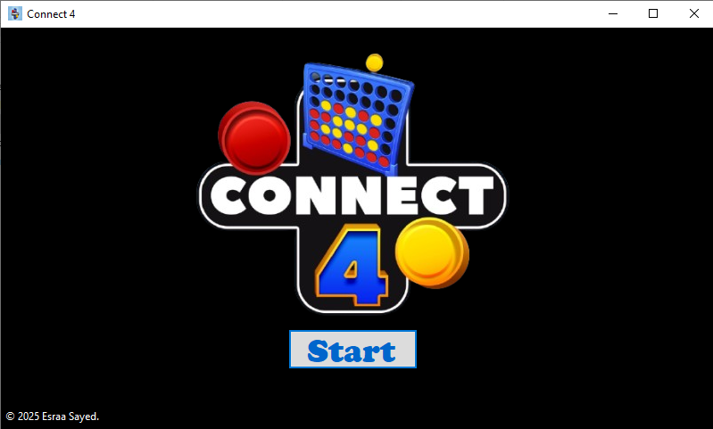
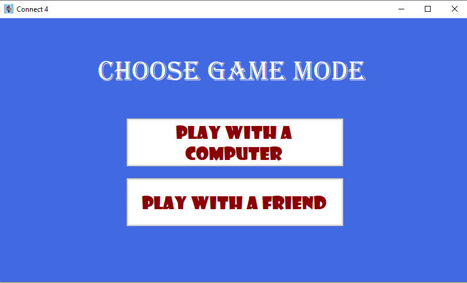
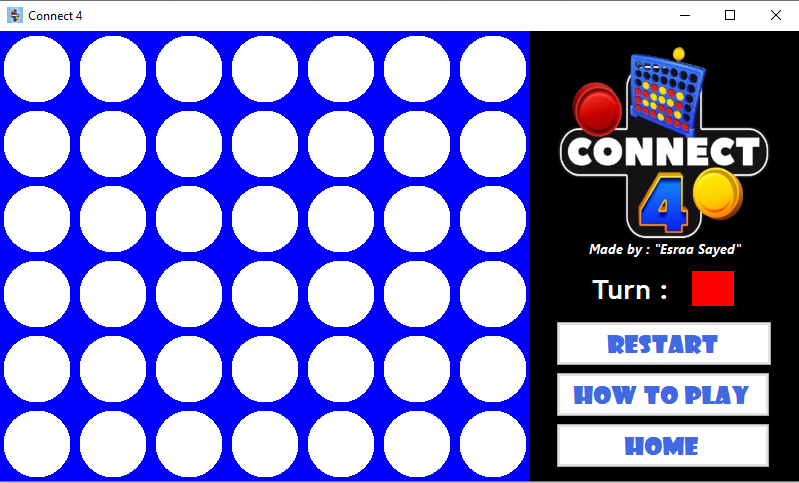
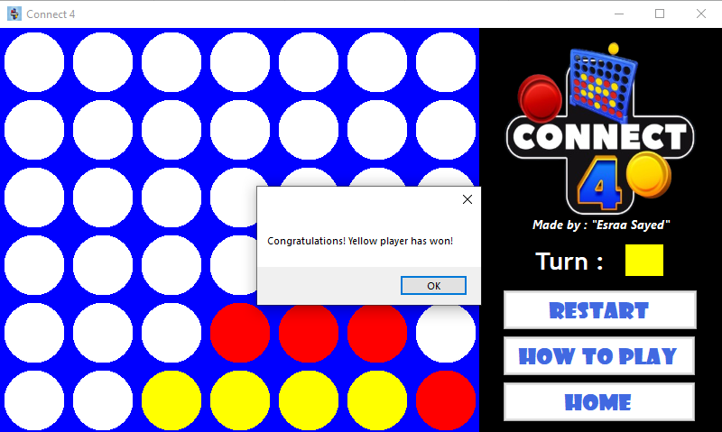

# Connect Four in C# WinForms

## About the Project  
This is a Connect Four game built as part of the Visual C# course at the ITI (Information Technology Institute), Full Stack .NET Track.  
It demonstrates how to combine **WinForms**, **game logic**, and **GDI+ drawing** into a fun project with a polished user experience.  

## Features  

### Two Modes  
- Player vs Player  
- Player vs Computer (with a basic AI that blocks and plays strategically)  

### Custom Board Rendering  
- Board and discs drawn with **GDI+**  
- Red and Yellow discs with proper alignment  

### Simple Controls  
- Click a column → disc drops automatically  
- Turn indicator panel shows whose turn it is  

### Game Management  
- Restart button resets the board instantly  
- Home button returns to the main menu (without opening new windows)  

### UI Flow  
- Splash screen with progress bar  
- Main menu with game mode selection  
- Embedded forms (game runs inside the same window for smooth navigation)  

---

## Screenshots  

📌 **Start Page**  
  

📌 **Game Mode Selection**  
  

📌 **Gameplay**  
 

📌 **Victory Popup 🎉**  

---

## How to Play  

1. Launch the application.  
2. Choose your game mode: *Play with Friend* or *Play with Computer*.  
3. Click on a column – your disc will drop to the lowest available slot.  
4. First to connect four in a row (**horizontal, vertical, or diagonal**) wins.  
5. Use the **Restart** button to play again, or **Home** to return to the menu.  

---

## Computer Logic  
The logic isn’t random – it follows simple strategy:  
- Play winning move if available.  
- Block opponent’s winning move.  
- Prefer central columns (classic Connect Four strategy).  

---

## Graphics  
Board and discs are drawn dynamically with **GDI+** using:  
- `Graphics.FillRectangle`  
- `Graphics.FillEllipse`  

---

## Tech Stack  
- C# .NET (WinForms)  
- Visual Studio  
- GDI+ Graphics  

---

## Future Improvements  
-  Add sound effects and background music  
-  Smarter AI with difficulty levels  
-  Disc drop animations  
-  Online multiplayer using SignalR or sockets  

---

## Final Note  
This game is both a **learning milestone** and a **fun project**.  

If you found it helpful or enjoyable, ⭐ star the repo – it really helps!  
Feedback and contributions are welcome.  
